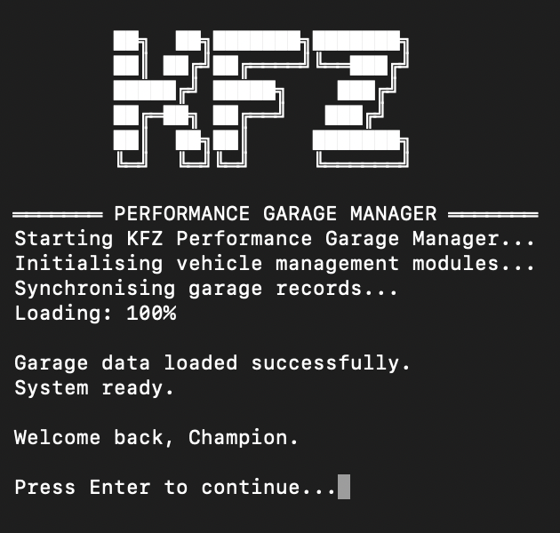
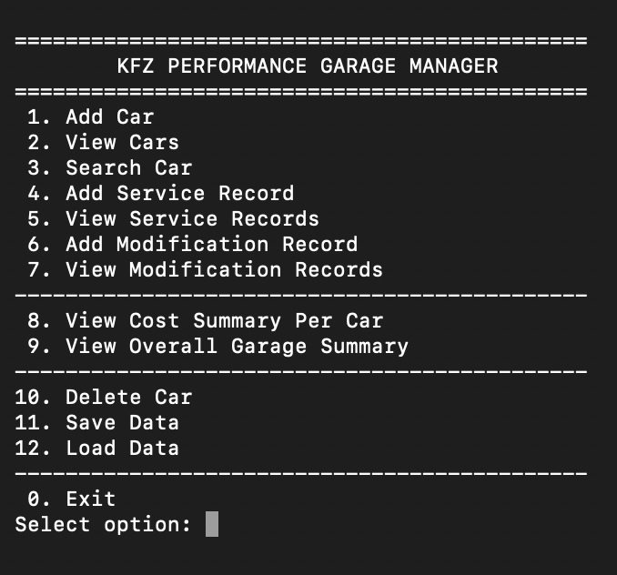
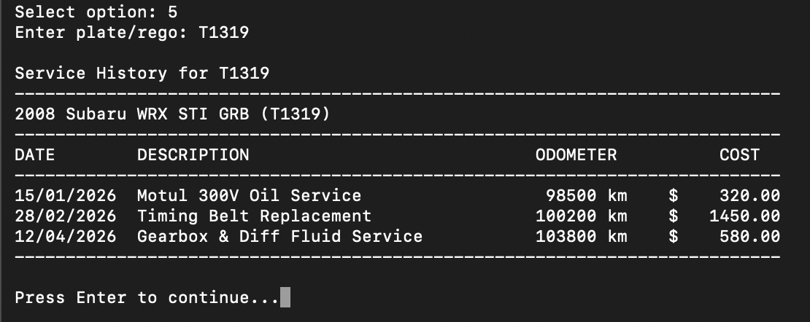
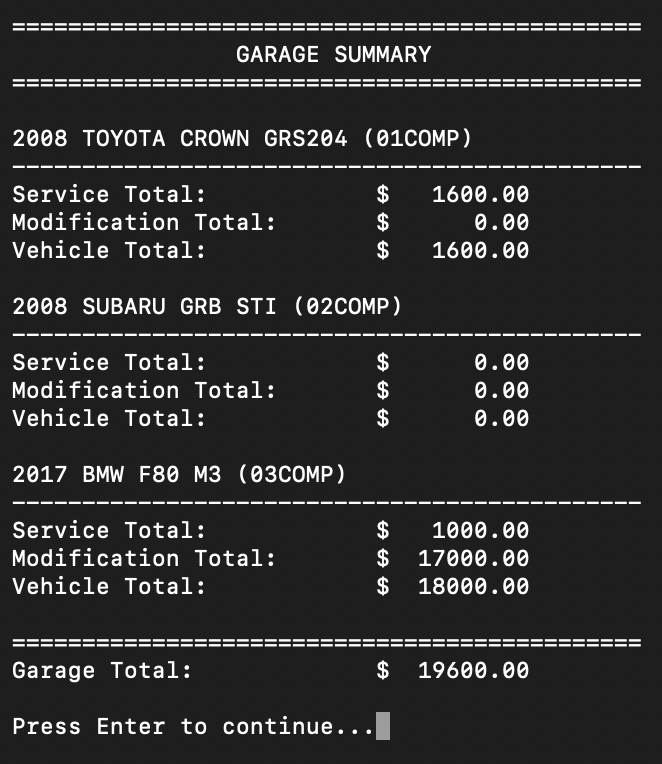

# KFZ Performance Garage Manager

Current Version: V2.0

A terminal-based vehicle management system built in Python for automotive enthusiasts, performance car owners, and garage-style record keeping.

The system allows users to manage multiple vehicles, record service history, track aftermarket modifications, calculate ownership costs, and store all garage data permanently using JSON file handling.

---

## Project Roadmap

See the full Version 2.0 development roadmap here:

[Version 2.0 Roadmap](VERSION_2_ROADMAP.md)

---

## Screenshots

### Startup Screen


### Main Menu


### Service History


### Garage Summary


---

## Overview

**KFZ Performance Garage Manager** was designed as a motorsport-inspired garage management tool.

It combines practical vehicle record keeping with a branded terminal interface, making it suitable for car enthusiasts who want to track servicing, modifications, and total build cost across multiple vehicles.

This project was developed as a Python-based system with a focus on:

- Object-Oriented Programming
- Object-Oriented System Design
- File handling with JSON
- Input validation
- Menu-driven terminal interaction
- Persistent data storage
- Clean formatted terminal output
- Automotive-focused user experience

---

## Key Features

### Vehicle Management

- Add new vehicles
- View all vehicles in the garage
- Search vehicles by plate/rego
- Delete vehicles from the garage

### Service Record Management

- Add service records
- View service history
- Edit service records
- Delete service records
- Store service date, description, odometer reading, and cost

### Modification Record Management

- Add modification records
- View modification history
- Edit modification records
- Delete modification records
- Store part name, category, and cost

### Cost Tracking

- Calculate total service cost per vehicle
- Calculate total modification cost per vehicle
- Display overall ownership cost per vehicle
- Display total garage-wide cost summary

### Data Persistence

- Save garage data to a JSON file
- Load previously saved garage data on startup
- Automatically save data when exiting the program

---

## Technologies Used

- Python 3
- JSON file handling
- Object-Oriented Programming (OOP)
- Terminal-based user interface
- Formatted table output

---

## Project Structure

```text
KFZ-Performance-Garage-Manager/
│
├── main.py
├── garage_data.json
├── README.md
├── VERSION_2_ROADMAP.md
│
└── screenshots/
    ├── startup.png
    ├── main-menu.png
    ├── service-history.png
    └── garage-summary.png
```

---

## How to Run

### 1. Make sure Python 3 is installed

Check Python version:

```bash
python3 --version
```

### 2. Open Terminal and navigate to the project folder

```bash
cd path/to/KFZ-Performance-Garage-Manager
```

### 3. Run the program

```bash
python3 main.py
```

---

## Example Use Cases

This system can be used to track:

- Daily driver maintenance
- Performance car service history
- Track car build costs
- Aftermarket modification records
- Workshop-style vehicle logs
- Ownership cost summaries

Example vehicles:

- Subaru WRX STI
- Audi RSQ8
- BMW M3 / M4
- Porsche GT3
- Nissan Skyline GT-R
- Toyota Supra

---

## Data Storage

Vehicle data is stored in:

```text
garage_data.json
```

Each vehicle record contains:

- Plate / rego
- Make
- Model
- Year
- Service records
- Modification records

The system rebuilds Python objects from the JSON file when loaded.

---

## Python Concepts Demonstrated

This project demonstrates several core Python concepts:

- Classes and objects
- Object composition
- Lists of objects
- Loops and conditional statements
- Functions and methods
- Exception handling
- JSON reading and writing
- String formatting
- User input validation
- CRUD-style management systems
- Terminal menu design

---

## Future Development Roadmap

Planned future improvements include:

- Date format validation
- Search and filter system
- Garage analytics dashboard
- Export reports to CSV or PDF
- Rego and insurance reminders
- Vehicle image support
- PostgreSQL database integration
- Web dashboard version
- Mobile-friendly interface
- Cloud-based garage storage
- Multi-user garage profiles

---

## Product Vision

The long-term vision of KFZ Performance Garage Manager is to become a modern digital garage platform for automotive enthusiasts.

Rather than being only a basic vehicle record system, the platform can evolve into a premium ownership and build-tracking ecosystem focused on:

- Performance vehicles
- Modification tracking
- Garage analytics
- Maintenance history
- Automotive culture
- Premium user experience

Designed for enthusiasts who view their vehicles as more than transportation.

---

## Version History

### V2.0

Major update introducing:

- Full CRUD management system
- Edit service records
- Delete service records
- Edit modification records
- Delete modification records
- Improved terminal workflow
- Refactored menu management
- Improved system structure

---

## Author

Created by Kevin Zhang.

Project concept:

**Performance Garage Manager for automotive enthusiasts and performance vehicle ownership tracking.**